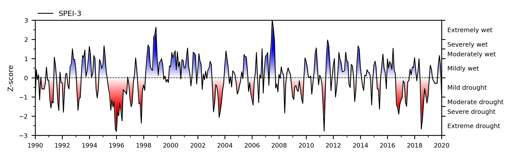

# Summary
SPEI is a Python package to calculate drought indices for time series. Popular Python packages such as Pandas [@pandas_paper_2010], Scipy [@scipy_paper_2020], and Matplotlib [@matplotlib_paper_2007] are used for handling time series, statistics, and visualization, respectively. This makes calculating and visualizing different drought indices with the SPEI package simple but versatile.

# Statement of need
Water is a vital natural resource essential for life on Earth. However, the global availability of freshwater is increasingly threatened by the impacts of climate change and human activities. If water availability is below normal conditions, a drought occurs. Droughts are classified as meteorological, hydrological, agricultural, or socioeconomic, often starting with meteorological droughts that trigger cascading effects. Many different indices have been developed to quantify droughts. These indices provide a way to quantitatively describe the severity, location, timing, and duration of a drought and are essential in tracking and predicting the impact of drought.

# Computation
Different drought indices exist to indicate different types of drought. For meteorological droughts, common indices are the Standardized Precipitation Index (SPI) [@mckee_spi_1993,;@lloydhughes_spi_2002], the Standardized Precipitation Evaporation Index (SPEI) [@vicenteserrano_spei_2010]. For hydrological droughts, common indices are the Standardized Groundwater Index (SGI) [@bloomfield_sgi_2013], the Standardized Streamflow Index (SSFI/SSI) [@vicenteserrano_ssfi_2010], and the Standardized Soil Moisture Index (SSMI) [@sheffield_ssmi_2004].

These standardized drought indices transform a time series into a standardized normal distribution. Generally, a time series spanning at least 30 years is recommended [@mckee_spi_1993]. Sets of rolling average periods are computed to define various time scales, typically spanning 1, 3, 6, 12, 24, or 48 months[^1]. Each dataset is fitted to a continuous probability density function to establish the relationship between the probability and the time series. The probability of any data point is determined and then transformed using the inverse normal distribution, assuming a normally distributed probability density function with a mean of zero and a standard deviation of one.

[^1]: Please note that a month does not represent an unambiguous time delta since a month can have 28 up to 31 days. This can result in some extra complexity in the computation, which is dealt with by the SPEI package internally.

## Implementation
The base of the SPEI Python package is Pandas [@pandas_paper_2010;@pandas_software_2020], which is heavily reliant on NumPy [@numpy_article_2020]. Pandas provides the `pandas Series` with a `DatetimeIndex` which supports extensive capabilities  for the manipulation of the time series. For instance, via the `resample` and `rolling` methods. Time series with outliers or missing values can also be handled by e.g., interpolation methods via Pandas` API.

The SciPy [@scipy_paper_2020] package provides probability density functions via its `stats` library. General recommendations are provided in literature about which probability density function to use for a drought index, e.g., a gamma distribution for the SPI or log-logistic/fisk distribution for the SPEI. However, with over 200 univariate continuous distributions in the scipy stats library, the user has the freedom to try and find different relations between the probability and the time series. Each SciPy continuous distribution has a `fit` method, making it easy to fit the distribution to the time series using maximum likelihood estimation.

## Example
In this article, an example dataset is considered with the measured daily precipitation and potential evaporation sum from the Royal Dutch Meteorological Institute (KNMI), as shown in Figure \autoref{fig:meteo_surplus}a. To calculate the SPI, only the precipitation time series is needed, while the SPEI uses the precipitation surplus (precipitation minus potential evaporation), also called rainfall or precipitation excess. The computed monthly precipitation surplus, used in this example, is visible in figure \autoref{fig:meteo_surplus}b.


When the time series is in the proper type (`pandas.Series` with a `DatetimeIndex` as index), the Python package provides a function for each separate drought index. For instance, when computing the SPEI-1, using a fisk (log-logistic) distribution, the code would look like the following:

```python
# load packages
import pandas as pd
import scipy.stats as sps
import spei as si

# load daily time series
meteo: pd.DataFrame = pd.read_csv(
  "meteo.csv",
  index_col="datetime",
  parse_dates=["datetime"]
)
prec: pd.Series = meteo["precipitation"]
evap: pd.Series = meteo["pot_evaporation"]

# compute monthly precipitation surplus
surplus: pd.Series = (prec - evap).resample("MS").sum() # MS: month-start

# compute SPEI-1
spei1: pd.Series = si.spei(
  series=surplus,
  dist=sps.fisk,
  timescale=1, # unit -> frequency of the data, in this case months
)
```

Figure \autoref{fig:surplus_fit}a shows the cumulative histogram of precipitation surplus data for March (orange step plot), individual data points (red circles, corresponding to the same points in Figure \autoref{fig:meteo_surplus}b), and the fitted Fisk distribution (blue line). The Fisk distribution provides a good fit for the data of March, capturing the skewed nature of the observed data. The dashed lines illustrate the cumulative probability of a specific precipitation value of 26 mm, corresponding to approximately the 64th percentile.


Figure \autoref{fig:surplus_fit}b demonstrates the standardization process. The fitted cumulative probabilities from the Fisk distribution are transformed to a standard normal distribution (purple line), resulting in standardized values or Z-scores, shown by the blue circles. The same cumulative probability (~64%) corresponds to a Z-score slightly around 0.37. This transformation enables the expression of precipitation anomalies on a normalized scale suitable for comparison across regions and timescales. Doing this for all months and data points results in the standardized index, SPEI-1, as shown in Figure \autoref{fig:spei1}.


## Visualization

### Series
Figure \autoref{fig:spei1} for instance, is not very informative if the user is not familiar with the standardized index methodology and the corresponding z-scores. Therefore, to visualize the drought indices in time and increase the information value, the SPEI package has multiple ways to visualize drought indices. For instance, with background filling to indicate dry (red) or wet (blue) periods \ref{fig:spei3}. Additionally, the drought category, as proposed by [@mckee_spi_1993], can be added for easier interpretation of the Z-scores.



### Multiyear drought

After [@mourik_use_2025] it is possible to visualize the standardized drought indices over several timescales (1, 3, 6, 12, and 24 months) within one graph. This can help with the interpretation of whether or not a drought persists over a long timespan. In the case of hydrological drought, there is a relation to the systems response time. The heatmap, as shown in Figure \autoref{fig:spei_heatmap}, indicates such a graph.


## Supported drought indices
At the time of writing the SPEI Python package supports explicitly the SPI, SPEI, SSFI, SSMI and SGI. However, any parametric standardized drought index can be computed with the package as long as an appropriate distribution is available in the SciPy library. A non-parametric approach, using the normal-scores transform to find the probability density function, is also available. The normal-scores transform is used by default for the SGI as proposed by [@bloomfield_sgi_2013].

## Other features
Meteorological or hydrological data is nowadays typically available on a daily basis. For this reason, the `timescale` argument in for the drought indices' function is designed to be flexible, with its unit matching that of the `fit_freq` argument.

When working with daily data, the user can choose a timescale value of 30 for a drought index of 1 month, 90 for 3 months, 180 for 6 months, etc. This daily frequency allows a distribution to be fitted for every day of the year. However, this significantly increases the computational load, as 365 (or 366 in leap years) distributions must be fitted instead of just 12 for a monthly `fit_freq`. By default, the package uses the `fit_freq` to determine on what frequency to fit the data. If no frequency is parsed, the frequency of the time series is inferred. If this inference fails, the fallback is a monthly frequency.

Fitting data on a daily frequency can be challenging, as the number of observations per calendar day can often be limited or adhere to a different probability. To address this, the `fit_window` argument allows the user to specify a window size (in the frequency of the data) for the fitting procedure. With a `fit_window` of 3 (days), for instance, data from the 14th and 16th of March are also included alongside data from the 15th of March when fitting the distribution. This feature is still experimental but has been shown to produce more stable results when fitting distributions to daily data.

# Acknowledgements
Thanks to all the scientists who used and cited this package [@adla_use_2024;@segura_use_2025;@mourik_use_2025;@panigrahi_use_2025] via @vonk_spei_zenodo. Thanks to Mark Bakker for reading this manuscript and providing feedback.

# References
