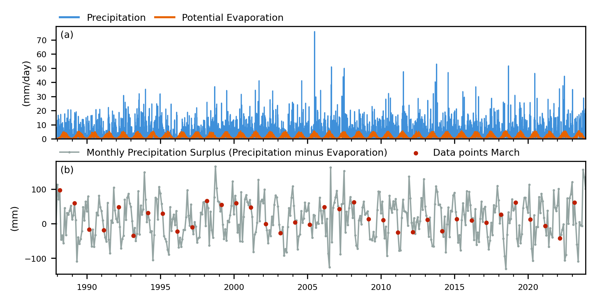
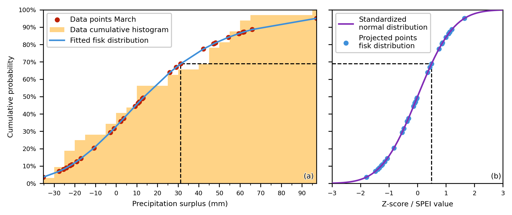
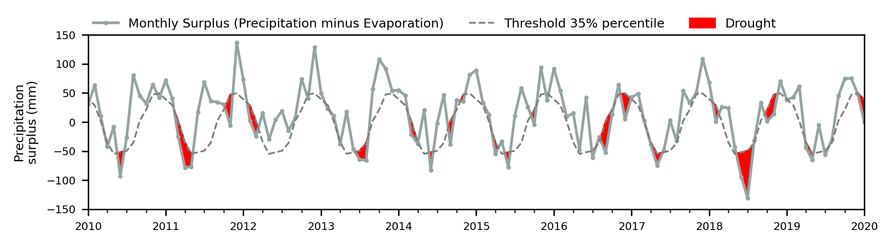
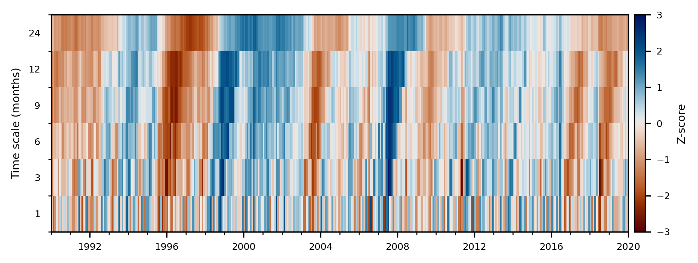

\openup 1em

# Summary
SPEI is a Python package to calculate drought indices for time series.
Popular Python packages such as Pandas [@pandas_paper_2010], SciPy [@scipy_paper_2020], and Matplotlib [@matplotlib_paper_2007] are used for handling the time series, statistics, and visualization, respectively.
This makes calculating and visualizing drought indices straightforward and flexible.

# Statement of need
Water is a vital natural resource and essential for all life on Earth.
However, the availability of freshwater is increasingly threatened by the impacts of droughts caused by climate change and human activities.
At its core, drought refers to a water deficit when compared to normal conditions [@sheffield_droughtdefinition_2011].
Importantly, both the definition of drought and the baseline for what constitutes "normal" conditions vary depending on the context and objectives of a given analysis [@dracup_droughtdefinition_1980].
As a result, many different drought indices have been developed to quantify drought characteristics.
These indices provide a way to quantitatively describe the severity, location, timing, and duration of a drought and are essential in tracking and predicting the impact of a drought.

# Standardized drought indices
The most common drought indices are standardized indices, which fit a time series to a probability distribution and transform it into a standardized normal distribution.
For meteorological droughts, widely used indices include the Standardized Precipitation Index (SPI) [@mckee_spi_1993; @lloydhughes_spi_2002] and the Standardized Precipitation Evaporation Index (SPEI) [@vicenteserrano_spei_2010]; for hydrological droughts, the Standardized Groundwater Index (SGI) [@bloomfield_sgi_2013] and the Standardized Streamflow Index (SSFI or SSI) [@vicenteserrano_ssfi_2010]; and for agricultural drought, the Standardized Soil Moisture Index (SSMI) [@sheffield_ssmi_2004].
All of these standardized indices are explicitly supported, though any other standardized drought index can also be computed using the same methodology.

## Computation
A time series of at least 30 years is recommended for calculating standardized indices [@mckee_spi_1993].
Rolling sums or averages are computed over typical time scales (e.g., 1, 3, 6, 12, 24, or 48 months)[^1], and each is fitted to a continuous probability distribution to relate probabilities to the data.
Alternatively, non-parametric methods like normal-scores transforms or kernel density estimates can be used.
The probability of each value is then transformed using the inverse normal distribution, yielding a standardized index with a mean of zero and standard deviation of one.

[^1]: A month is not an unambiguous time unit, varying between 28 and 31 days, which adds complexity to computations.
The package handles this internally using Pandas to ensure consistent time aggregation.

### Implementation
The SPEI Python package is built on Pandas [@pandas_paper_2010; @pandas_software_2020], which in turn relies heavily on NumPy [@numpy_article_2020].
It uses `pandas.Series` with a `DatetimeIndex`, enabling powerful time series operations such as resample and rolling.
Probability density functions are provided via SciPy's `stats` module [@scipy_paper_2020].
While literature offers general guidance; e.g., a gamma distribution for SPI [@thom_gamma_1996] and a fisk (log-logistic) distribution for SPEI, users are free to experiment with any of the 200+ univariate continuous distributions available.
Each distribution has a `fit` method for maximum likelihood estimation.

#### Example
As an example, drought indices are computed using a dataset with daily precipitation and potential evaporation from the Royal Dutch Meteorological Institute (KNMI), shown in \autoref{fig:meteo_surplus}a.
The SPI requires only precipitation, while the SPEI uses the precipitation surplus (precipitation minus potential evaporation), which is aggregated monthly and shown in \autoref{fig:meteo_surplus}b.



The package provides functions for each drought index; for example, computing SPEI-1 (`-1` denoting a one month time scale) with a fisk distribution:

```python
# load packages
import pandas as pd
import scipy.stats as sps
import spei as si

# load daily time series
meteo: pd.DataFrame = pd.read_csv(
  "meteo.csv",
  index_col="datetime",
  parse_dates=["datetime"],
)
prec: pd.Series = meteo["precipitation"]
evap: pd.Series = meteo["pot_evaporation"]

# compute monthly precipitation surplus
surplus: pd.Series = (prec - evap).resample("MS").sum() # MS: month-start

# compute SPEI-1
spei1: pd.Series = si.spei(
  series=surplus,
  dist=sps.fisk,
  timescale=1, # unit: frequency of the data (months in this case)
)
```

The standardization process is illustrated in \autoref{fig:surplus_fit}.
The empirical cumulative density function of the surplus in March (red dots, matching \autoref{fig:meteo_surplus}b) with the fitted fisk distribution are shown in \autoref{fig:surplus_fit}a.
The fitted probabilities (blue dots) are transformed into a standard normal distribution (purple line), producing Z-scores.
The black dashed line traces this for a 31 mm surplus from March 1994, near the 69th percentile, corresponding to a Z-score of about 0.4925.



Doing this for all data points and months results in the standardized index, SPEI-1, as shown in \autoref{fig:spei1}.
The background filling and categories [based on @mckee_spi_1993] in \autoref{fig:spei1} allow for the interpretation of the drought during the 1990-2020 period.
The package has extra options to allow for other time scales, time series frequencies (e.g., daily) and fit window options to ensure valid distribution fit.


## Threshold
Drought characteristics can also be derived from time series using a threshold level.
This defines at what level a drought starts and how large the deficit, the water lacking between the threshold and time series, is.
The threshold can be either fixed or variable.
A variable threshold, as seen in \autoref{fig:threshold}, is typically derived from percentiles of the time series or from a fitted probability density function [@vanloon_hydrodrought_2015].



## Heatmap
When multiple time scales are used, standardized drought indices can be visualized in a single graph to reveal whether a drought persists over time and to identify the build-up to multi-year droughts [@mourik_use_2025].
For hydrological droughts, this persistence relates to the system’s storage capacity and memory (i.e., response time) [e.g., @bloomfield_sgi_2013], as illustrated by the SPEI heatmap in \autoref{fig:spei_heatmap}, which shows six time scales: 1, 3, 6, 9, 12, and 24 months.



# Other drought indices

## Rainfall anomaly index
The Rainfall Anomaly Index (RAI) is a relative drought index that quantifies deviations from historical precipitation to identify dry and wet periods [@vanrooy_rai_1965], without fitting a probability density function.
This package also includes the Modified RAI (mRAI) [@hansel_mrai_2016], which adds a scaling factor for local conditions.

## Climdex
Climdex is an online platform providing indices for heat, cold, precipitation, and drought changes over time [@alexander_climdex_2025], with several of its precipitation indices available in the SPEI Python package.

## Precipitation deficit
The KNMI defines drought during the growing season using the precipitation deficit (potential evaporation minus precipitation).
This package includes five functions [after @witte_knmi_2025] to calculate this absolute drought index, primarily for the Netherlands but adaptable to other regions by adjusting the keyword arguments.

# Acknowledgements
Thanks to all the scientists who used and cited this package so far [@adla_use_2024;@segura_use_2025;@mourik_use_2025;@panigrahi_use_2025] via Zenodo [@vonk_spei_zenodo].
Thanks to Mark Bakker for reading this manuscript and providing feedback.

# References
